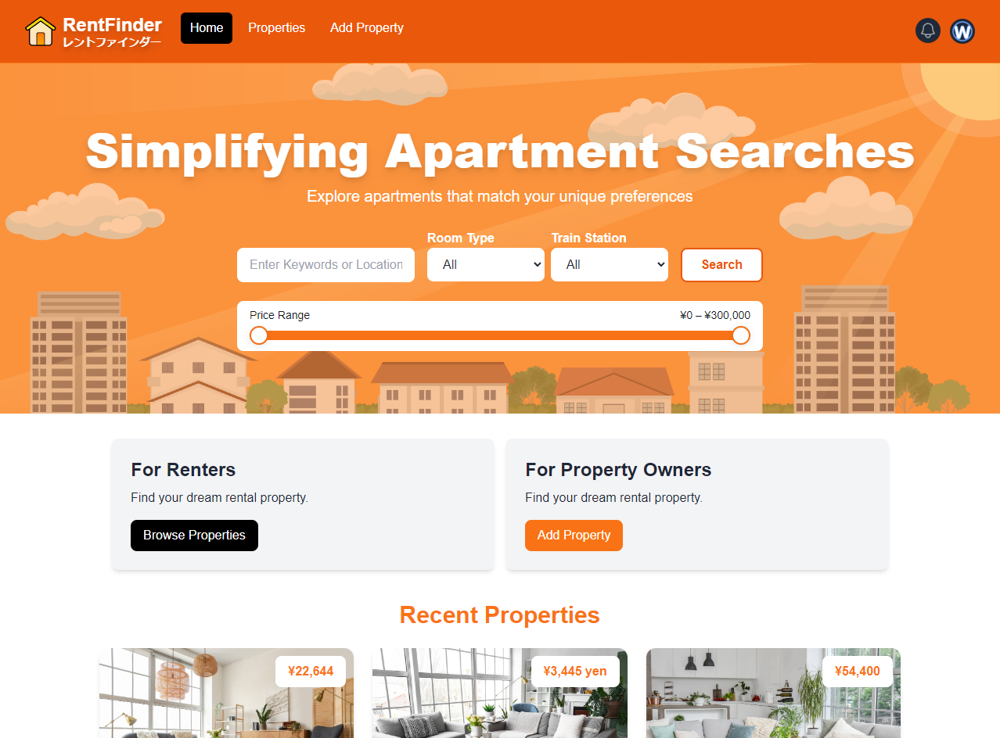
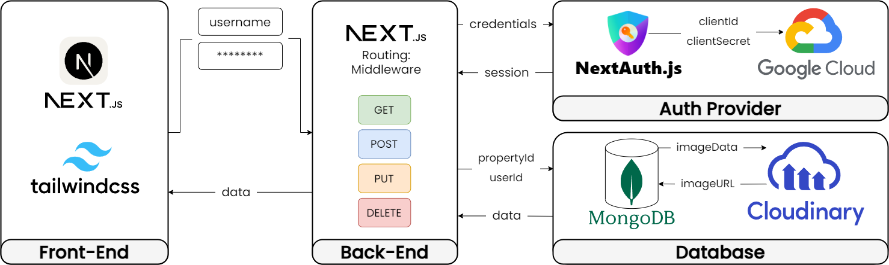

# RentFinder

_Simplifying Apartment Searches_
  

  

## Overview

RentFinder helps you quickly and easily find the perfect apartment that fits your preferences and budget.
  

## Tech Stack

### Front-End

RentFinder's front-end is built with Next.js, enabling fast, SEO-friendly applications through server-side rendering and static site generation. Tailwind CSS is used for rapid UI development with a clean, maintainable codebase, ensuring a seamless user experience for navigating listings and searching properties.

### Back-End

The back-end of RentFinder leverages Next.js as a full-stack solution, utilizing the App Router for intuitive and scalable page routing and Route Handlers for managing API endpoints efficiently. NextAuth.js is integrated for seamless Google authentication, and middleware functions ensure secure and optimized request processing, enhancing the overall robustness and security of the application.

### Database

RentFinder uses MongoDB, a document database, for its flexibility in handling complex data structures like property listings and user information. Cloudinary handles image storage and optimization, ensuring fast delivery of high-quality property images.
  

## Features

### Search By Keyword Feature

https://github.com/user-attachments/assets/78975413-5fe2-4c86-8529-b4c86c3dab51

The search feature allows you to search for apartments by using keywords. You can search by city, how many minutes to train station, and filter the price range.

### Authentication Feature

https://github.com/user-attachments/assets/a9cef685-3f6e-4ba4-b341-991fe876a26f

By leveraging NextAuth.js, and Google provider. Users can easily sign in to add or edit a property. User profile will be automatically created by retrieving user data such as name, email, and profile picture from their google account.

### Add Property Feature

https://github.com/user-attachments/assets/f3c29d1b-1a52-4502-be17-3edd15a97e44

The add property feature allows you to add a new property to the database. After logged in, the property manager can add a new property by filling out the form and upload images.

### Property Details Feature

https://github.com/user-attachments/assets/fae5f05e-adf7-41fa-8e9f-8e9854d86c07

When a user clicks on a property card, they will be directed to the property details page. The page contains all the property details information in sections. The cost section provides monthly costs, fees, and deposit information. The description section gives details such as room sizes, amenities, building age, and distance from the train station. It also includes room pictures and the property's map location.

### Bookmark and Messaging Feature

https://github.com/user-attachments/assets/b33594af-a574-40aa-b251-4d764e9986c0

When you find a property that you are interested in, you can saved it to your bookmark list. You can also send a message to the property owner to ask for more information.

### Profile Listing Edit Feature

https://github.com/user-attachments/assets/4174b7f7-54e9-4c73-9d19-46330c647fd2

In the profile page, property owner can view all of their property listings. They can also edit or delete the property details.
